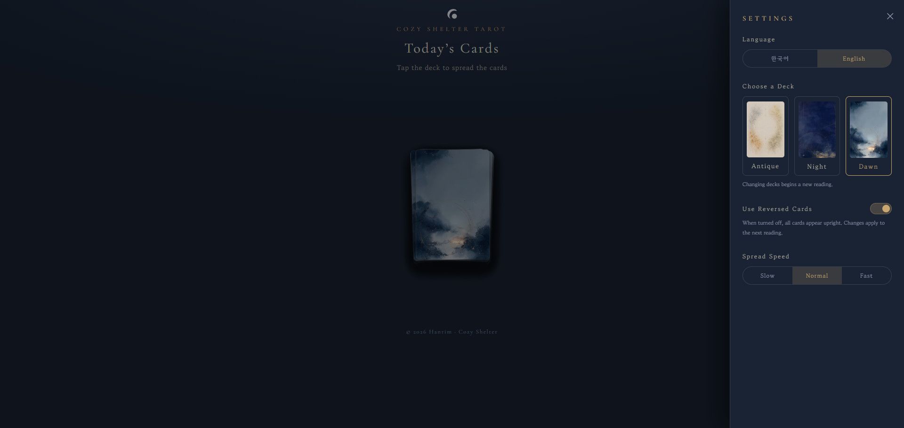
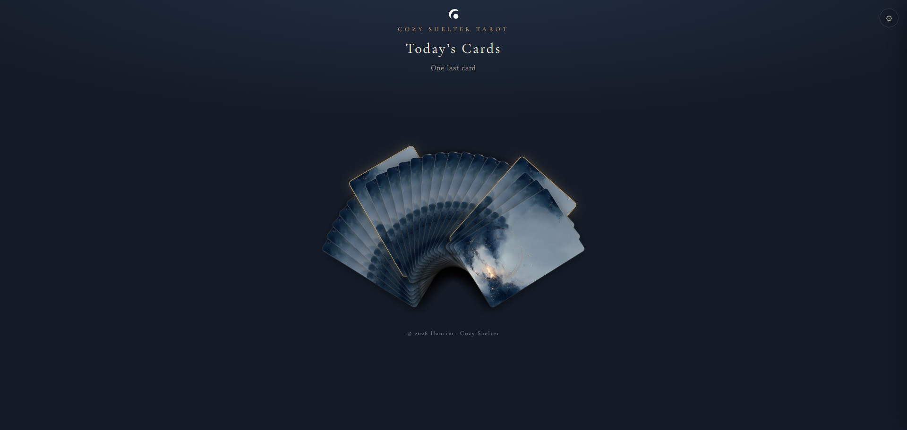
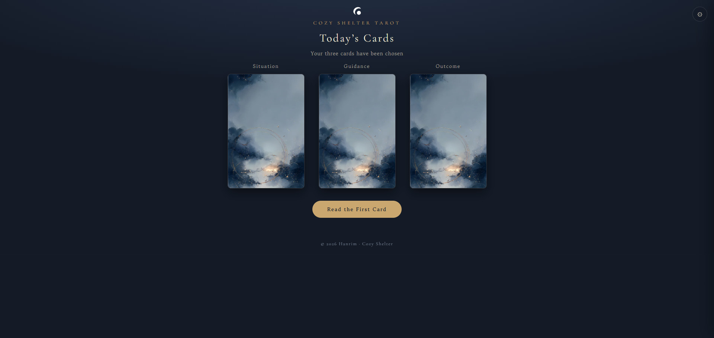
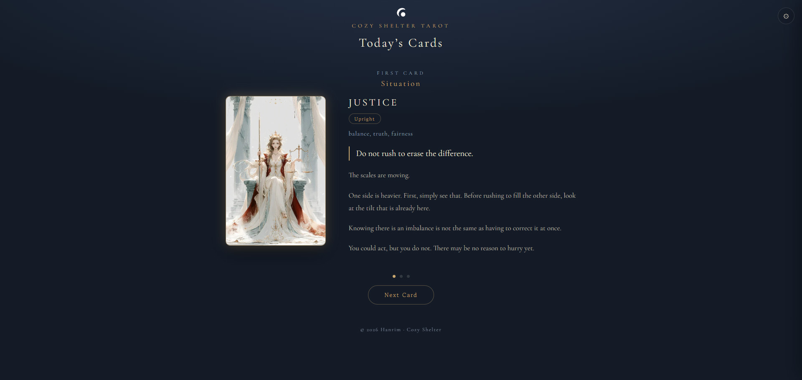
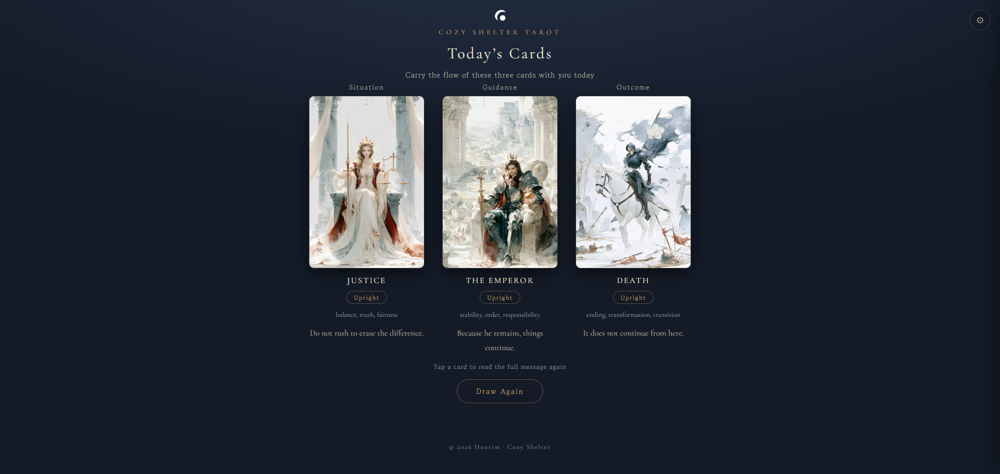

# Cozy Shelter · Today's Cards

[](LICENSE)

A daily tarot draw web app — pull one card a day. Supports all 22 Major Arcana cards across three deck themes, in Korean and English. Plain static HTML/CSS/JS, no build step.

**Live:** https://cozy-shelter-tarot.workers.dev <!-- replace with the actual deployed URL -->

## Screenshots

| Settings | Spread | Three cards chosen |
|---|---|---|
|  |  |  |

| Reading | Today's summary |
|---|---|
|  |  |

## Decks

22 Major Arcana cards × 3 art styles

- **Antique (고서)** — ink-wash style — `assets/v1`
- **Night (밤)** — oil-painting style — `assets/v2`
- **Dawn (새벽)** — watercolor style — `assets/v3`

## Structure

```
index.html          Main page (all app logic lives here)
assets/v1..v3       Card artwork per deck (webp)
assets/ci           Cozy Shelter brand mark (header / favicon)
assets/screenshot   Screenshots used in this README
wrangler.jsonc      Cloudflare Worker static-assets deploy config
```

## Deployment

Deployed automatically to Cloudflare Workers via Git integration. Pushing to `main` triggers a redeploy.

## License

Copyright © 2026 Hanrim · Cozy Shelter. All Rights Reserved.

All content in this repository, including the code and card artwork, is original work. Reproduction, redistribution, or reuse — in whole or in part, including forking for republication — is prohibited without prior written permission from the copyright holder. See [LICENSE](LICENSE) for details.

## Note

This repository is a lean, deploy-only copy. Original source images and work-in-progress backups are kept in a separate private workspace repository.
